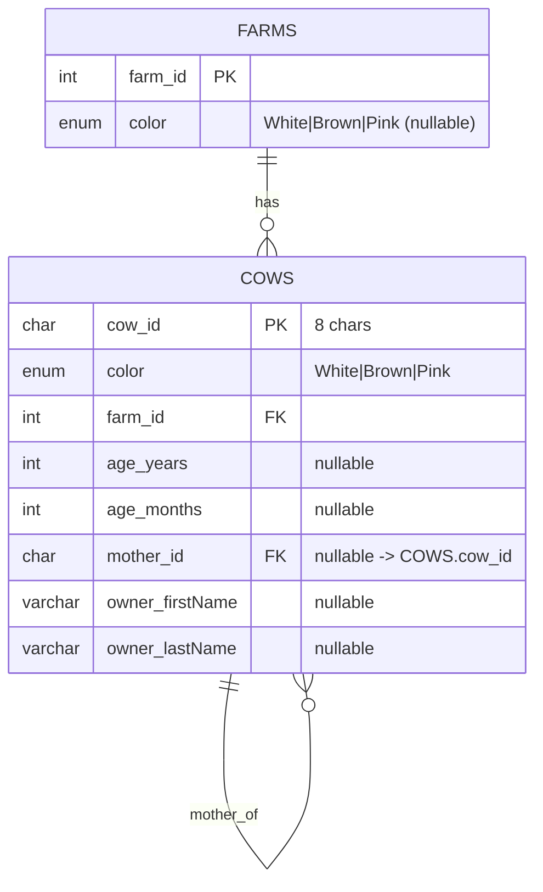

## ER Diagram

```mermaid
erDiagram
    FARMS ||--o{ COWS : "has"
    COWS  ||--o{ COWS : "mother_of"

    FARMS {
      int farm_id PK
      enum color "White|Brown|Pink (nullable)"
    }

    COWS {
      char cow_id PK "8 chars"
      enum color "White|Brown|Pink"
      int  farm_id FK
      int  age_years "nullable"
      int  age_months "nullable"
      char mother_id FK "nullable -> COWS.cow_id"
      varchar owner_firstName "nullable"
      varchar owner_lastName "nullable"
    }
```
